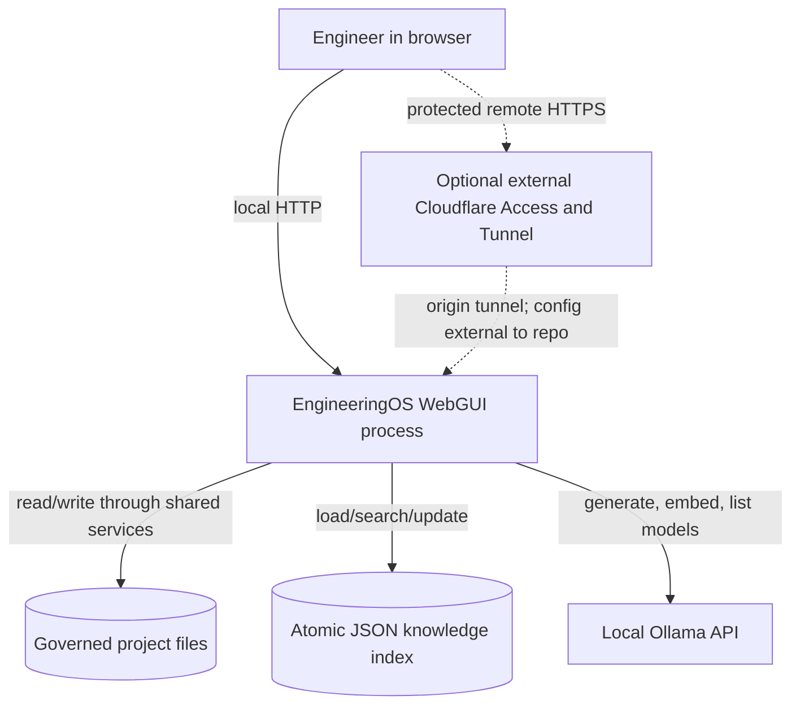
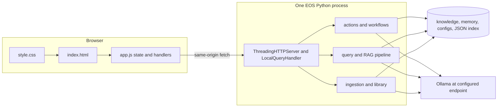
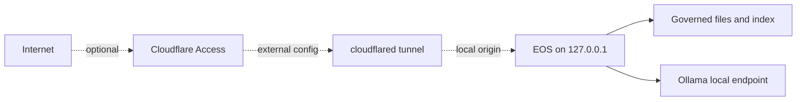

# EngineeringOS WebGUI Architecture

[WebGUI home](README.md) · [Project architecture](../ARCHITECTURE.md) ·
[Relevant decisions](../DECISIONS.md)

This document describes the implementation at repository commit `c841b51` as
inspected on 2026-09-14. Host deployment details not represented in the
repository are explicitly marked unknown.

## 1. System Context

The WebGUI is an adapter over the same application services used by the EOS
CLI. It does not contain an independent RAG implementation.



The process may read governed knowledge, memory, configuration, and project
structure through shared Python modules. Browser document retrieval is narrower:
only governed Markdown and PDF documents under the configured knowledge root
are openable. There is no general source-code browser API.

## 2. Runtime Architecture

### Processes

| Process/service | Entry point | Listen address | Dependencies | Start and stop |
| --- | --- | --- | --- | --- |
| Browser | `engineering_os/web_static/index.html` and `app.js` | none | EOS HTTP origin | Open/close the page |
| EOS WebGUI | `python3 -m engineering_os.web`; `engineering_os.web:main` | hardcoded `127.0.0.1`, default port `8081` | Python >=3.10, repository/config files; Ollama for model-backed operations | Foreground command; `Ctrl+C` closes the server |
| Ollama | External runtime configured in `configs/ai/providers.json` | default `localhost:11434` | Installed model weights | Lifecycle is external to this repository |
| `engineeringos-web.service` | Unit file is not in the repository; this is the diagnostic default and was observed on one deployed host | expected local WebGUI origin | deployment-specific unit | Use systemd only on a host where the unit exists |
| `cloudflared.service` | Tunnel config/unit are not in the repository; this is the diagnostic default and was observed on one deployed host | deployment-specific | Cloudflare account, tunnel, and Access policy | External deployment operation |

The WebGUI port can be changed with `--port`; the host cannot be changed from
the CLI. This loopback-only bind is the application security boundary. Remote
access therefore requires a local tunnel or proxy rather than a public bind.



`LocalQueryServer` creates daemon request threads. Model-backed and other
bounded operations share a `threading.BoundedSemaphore` sized from the
provider's `maxConcurrentRequests` value (currently 2). Static reads and health
checks do not acquire it.

### HTTP surface

Only these routes exist:

| Method | Route | Implementation and purpose |
| --- | --- | --- |
| GET | `/` | Serve `index.html` |
| GET | `/app.js` | Serve browser JavaScript |
| GET | `/style.css` | Serve stylesheet |
| GET | `/health` | Process liveness: `{"status":"ok"}` |
| GET | `/api/v1/actions` | Return the typed action catalog |
| GET | `/api/v1/knowledge/documents` | Search/filter governed library metadata |
| GET | `/api/v1/knowledge/document?path=...` | Inline governed Markdown/PDF content |
| POST | `/api/v1/query` | Grounded RAG question |
| POST | `/api/v1/knowledge/ingest` | Save and optionally index one upload/paste |
| POST | `/api/v1/knowledge/retry-index` | Retry one saved inbox document |
| POST | `/api/v1/actions/<id>` | Execute an `ACTION_CATALOG` action |
| POST | `/api/v1/workflows/<id>` | Run one registered engineering workflow |

All other paths and methods return a JSON 404. Static serving is an explicit
three-path allowlist, not directory serving. Action IDs and workflow IDs are
defined in `engineering_os/actions.py` and `engineering_os/workflows.py`.

## 3. Request Flow

### Grounded question

```mermaid
sequenceDiagram
    actor User
    participant UI as app.js submitAsk
    participant HTTP as web.py LocalQueryHandler
    participant Query as query.py query_knowledge
    participant Search as hybrid_search and reranker
    participant LLM as llm.py OllamaRuntime
    participant RAG as rag.py answer_question

    User->>UI: Enter question and click Send or Ctrl+Enter
    UI->>UI: trim and validate; copy query; clear textarea
    UI->>HTTP: POST /api/v1/query JSON
    HTTP->>HTTP: validate media type, size, fields, role, filters
    HTTP->>Query: query_knowledge(paths, query, options)
    Query->>Query: load settings, runtime definition, and compatible index
    Query->>Search: embed query + dense/BM25 hybrid search + weighted RRF
    Search-->>Query: deterministic local reranked candidates
    Query->>RAG: answer_question(... candidates ...)
    alt evidence below confidence threshold
      RAG-->>Query: insufficient evidence, no generation
    else evidence passes
      RAG->>LLM: generate grounded answer with rag/reasoning role
      LLM-->>RAG: complete generated text
      RAG->>RAG: verify claims and retain supported citations
      RAG-->>Query: RAGResponse
    end
    Query-->>HTTP: RAGResponse
    HTTP-->>UI: one complete JSON response
    UI->>UI: add answer, sources, and optional diagnostics
```

`submitAsk()` in `app.js` is shared by the Send button and `Ctrl+Enter`. It
copies the trimmed value before clearing the textarea, so clearing does not
change the request. Empty input is rejected and remains untouched. Search-only
mode instead calls action `knowledge.search`; it uses the same Hybrid retrieval
and reranker but skips generation and claim verification.

### RAG data flow

```mermaid
flowchart LR
    Docs[Markdown, text PDF, optional memory/log inputs] --> Parse[Parse and semantic chunk]
    Parse --> Meta[Chunk metadata and stable IDs]
    Meta --> Build[Ollama embeddings and BM25 corpus]
    Build --> Index[(runtime/index/knowledge.json)]
    Question[Question] --> Hybrid[Dense + BM25 + weighted RRF]
    Index --> Hybrid
    Hybrid --> Rerank[Deterministic local rerank]
    Rerank --> Gate{Confidence gate}
    Gate -->|weak| Abstain[Insufficient evidence]
    Gate -->|pass| Generate[Ollama generation]
    Generate --> Verify[Post-generation claim verification]
    Verify --> Answer[Answer with governed citations]
```



Ingestion writes the source under `knowledge/inbox/` before indexing. A failed
embedding/index update returns HTTP 207 and keeps the saved document. Index
writes use a file lock and atomic temporary-file replacement. A complete Web
rebuild requires a current server-generated preview token and confirmation.

## 4. Streaming Flow

There is no end-to-end browser streaming, SSE, WebSocket, chunked UI renderer,
or request cancellation.

`configs/ai/runtime.json` currently sets `stream: true`, which tells Ollama to
produce NDJSON. `OllamaRuntime._generate_stream()` calls
`OllamaHttpClient.request_json_lines()`, but `_request()` first calls
`response.read()` and buffers the entire upstream response. The Web handler
then waits for retrieval, generation, and claim verification before
`_send_json()` writes one body with `Content-Length`. Finally,
`requestJson()` calls `response.json()` and renders only the completed result.

The Ollama HTTP timeout is 300 seconds from `providers.json`. The browser has
no explicit timeout or `AbortController`. If the connection or runtime fails,
the frontend marks the Activity item failed and shows a safe message; a page
reload marks an in-flight stored Activity item `unknown` and never replays it.

## 5. State Management

| State | Location | Lifetime |
| --- | --- | --- |
| Selected screen/mode/workflow/tab and current previews/results | `state` object in `app.js` | Current page only |
| Ask and model-chat rendered messages | DOM | Current page only; not sent as conversation history |
| Activity summaries | `state.activities` plus localStorage key `engineeringos.activity.v2` | Last 8 bounded summaries in this browser |
| Confirmation callbacks and organization preview | browser memory | Current page only |
| Request concurrency | server `BoundedSemaphore` | Python process lifetime |
| Knowledge documents | governed repository files | Persistent filesystem |
| Embeddings and BM25 corpus | `runtime/index/knowledge.json` | Persistent generated state |

There are no accounts, cookies created by the application, sessions, server-side
conversation store, database, job queue, or persistent background job worker.

## 6. Configuration

| Setting | Source | Current/default behavior |
| --- | --- | --- |
| Project root | `--root`, default `.` | Fixed as `ProjectPaths.root` at startup |
| Web port | `--port`, default `8081` | Valid range 0-65535; `0` selects an ephemeral port |
| Web host | `DEFAULT_HOST` in `web.py` | Fixed `127.0.0.1` |
| Knowledge root/index/inbox | `configs/settings.json` | `knowledge/`, `runtime/index/knowledge.json`, `knowledge/inbox/` |
| Ingestion source maximum | `configs/settings.json` | 2 MiB; HTTP JSON envelope maximum is 3 MiB |
| Retrieval/rerank/grounding | `configs/settings.json` | Shared CLI/Web policies |
| Provider endpoint/timeout/concurrency | `configs/ai/providers.json` | Ollama, 300 s, 2 concurrent bounded operations |
| Role-to-model mappings | `configs/ai/models.json` | rag/chat/reasoning/coding/embedding |
| Generation options | `configs/ai/runtime.json` | temperature, top-p, 512 tokens, upstream stream flag |
| Ollama endpoint override | `ENGINEERINGOS_OLLAMA_ENDPOINT` | Replaces configured provider endpoint |

`EOS_STATUS_*` variables belong only to `scripts/eos-status`; they do not
configure the server. The `logging` object in `configs/settings.json` is not
read by `engineering_os.web` and does not create WebGUI log files.

## 7. Security Boundaries



- The application binds only to loopback. Do not expose Ollama or repository
  filesystem paths directly to the Internet.
- The application implements no login, authorization roles, CSRF token, or TLS.
  Mutating endpoints reject an `Origin` whose authority differs from `Host`,
  but requests without `Origin` are accepted. Remote identity and TLS, where
  used, are external Cloudflare Access responsibilities.
- JSON bodies, fields, lengths, roles, filters, filenames, and paths are
  allowlisted. Document reads reject traversal, symlinks, non-Markdown/PDF
  content, and files outside the knowledge root.
- Browser rendering uses `textContent`/`<pre>` for model and document output;
  it does not insert model output as HTML.
- Prompts, document bodies, credentials, and embeddings are not persisted in
  Activity. Default HTTP access logging is suppressed to avoid logging queries.
- Project/index mutations use explicit confirmation and a server-revalidated
  preview token. The WebGUI does not approve ADRs or execute workflow input.

Cloudflare protection was observed and documented operationally, but tunnel
ingress, credentials, and Access policy are absent from this repository. They
must be audited on the deployment host/account.

## 8. Error Handling

The backend returns JSON errors as `{"error":{"code":"...","message":"..."}}`.
Known validation errors use 400, wrong media type 415, oversized input 413,
cross-origin mutation 403, workflow/action completion errors 422, unknown
routes 404, and sanitized unexpected failures 500. A saved document whose
indexing failed is a usable partial result with HTTP 207.

`requestJson()` surfaces the server's safe message, including 207 as a usable
response. `runOperation()` records success/failure, shows the global error, and
rethrows so the feature handler can render its own fallback. Backend exception
details are deliberately not returned. The server also suppresses the standard
request log; diagnosis therefore uses the foreground terminal or external
service journal, but unhandled details may be sparse.

LLM connection, HTTP, timeout, invalid JSON, missing model, and embedding-size
problems become `LLMError` in `llm.py`. Query routes sanitize all such failures
to a 500; action/workflow routes use their corresponding safe 422/500 response.
An unavailable or incompatible index is visible in the Knowledge/Project state;
a query against it fails rather than silently using demo data.
