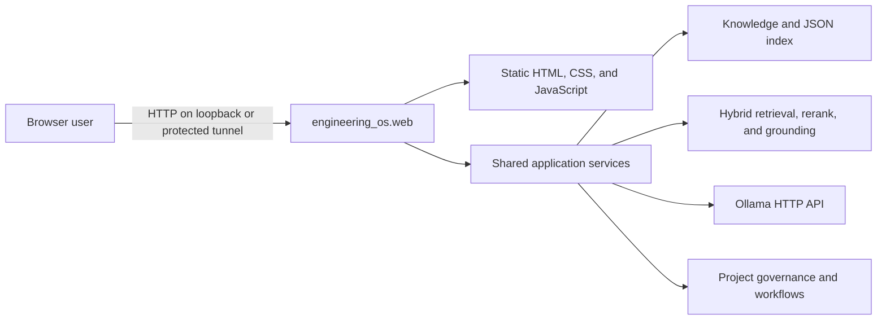

# EngineeringOS WebGUI

[Documentation index](../README.md) · [Repository governance](../STRUCTURE_GOVERNANCE.md)

This directory is the canonical engineering entry point for the WebGUI. It is
under `docs/` because the repository already assigns architecture and
operations documentation to that area; the existing [WebUI user guide](../WEBUI_GUIDE.md)
remains the concise product-facing guide.

## Purpose

The EngineeringOS WebGUI is a local, production-data browser interface for the
existing EngineeringOS Python services. It gives an engineer five workspaces:
Knowledge, Ask EOS, Engineering, Models, and Project, plus a shared Activity
view. It serves the current governed repository and configured local Ollama
runtime; there is no frontend demo-data path.

The WebGUI owns browser interaction, an allowlisted local HTTP adapter, request
validation, and safe serialization of core results. It does not own the RAG
algorithms, model runtime, knowledge storage policy, project governance,
systemd, Cloudflare configuration, deployment, or ADR approval. It also does
not expose arbitrary repository files or execute submitted code or shell text.

## Quick Architecture Overview

`engineering_os.web` uses Python's `ThreadingHTTPServer`. The same process
serves the dependency-free browser files and JSON API. It binds to
`127.0.0.1:8081` by default. Core modules are called directly in-process;
Ollama is the only separately configured application dependency.

## Start Here

- [Architecture](ARCHITECTURE.md): processes, routes, request flows, state,
  configuration, security, and error contracts.
- [Operations](OPERATIONS.md): installation, lifecycle, health, logs,
  dependency checks, remote access, and recovery.
- [Maintenance](MAINTENANCE.md): source ownership, safe-change workflow,
  impact matrix, extension points, and debt.
- [Troubleshooting](TROUBLESHOOTING.md): symptom-driven diagnosis and repair.
- [WebUI user guide](../WEBUI_GUIDE.md): end-user behavior of the five
  workspaces.
- [Command and Web coverage](../COMMAND_COVERAGE.md): CLI/web capability map.

## Source Map

| Responsibility | Source location |
| --- | --- |
| Web process entry point and HTTP server | `engineering_os/web.py` (`main`, `create_server`) |
| Static and API routing | `engineering_os/web.py` (`LocalQueryHandler`) |
| Browser markup | `engineering_os/web_static/index.html` |
| Browser behavior and state | `engineering_os/web_static/app.js` |
| Browser styling and responsive layout | `engineering_os/web_static/style.css` |
| Allowlisted Web actions | `engineering_os/actions.py` |
| Question orchestration | `engineering_os/query.py` |
| Retrieval, chunking, reranking, and grounding | `engineering_os/retrieval.py`, `chunking.py`, `reranking.py`, `rag.py` |
| Knowledge index and persistence | `engineering_os/knowledge.py`, `runtime/index/knowledge.json` |
| Knowledge upload and retry | `engineering_os/ingestion.py` |
| Governed document listing and reads | `engineering_os/library.py` |
| Engineering workflows | `engineering_os/workflows.py` |
| Ollama adapter | `engineering_os/llm.py` |
| Project and AI configuration | `configs/settings.json`, `configs/ai/*.json` |
| Operational diagnostics | `scripts/eos-status` |
| HTTP/frontend contract tests | `tests/test_web.py` |
| Shared service tests | `tests/test_actions.py`, `tests/test_query.py`, `tests/test_rag.py`, `tests/test_llm.py` |

The WebGUI has no template engine, frontend package manifest, bundler, or
generated asset directory. The three static files are served directly.

## Keeping These Docs Current

Any change affecting web architecture, HTTP/API interfaces, startup, runtime
configuration or dependencies, streaming, RAG integration, authentication, or
remote access must evaluate and update this documentation in the same change.
Update the relevant tests and the [development resume](../../prompts/Resume_EngineeringOS_Development.md)
as required by the repository workflow.

## Extension Rules

Keep implementation facts here and link to canonical project-wide guidance
instead of copying it. Do not add secrets, host credentials, Access tokens, or
private knowledge examples. New files in this directory must stay within
WebGUI architecture, operation, maintenance, or troubleshooting scope.
